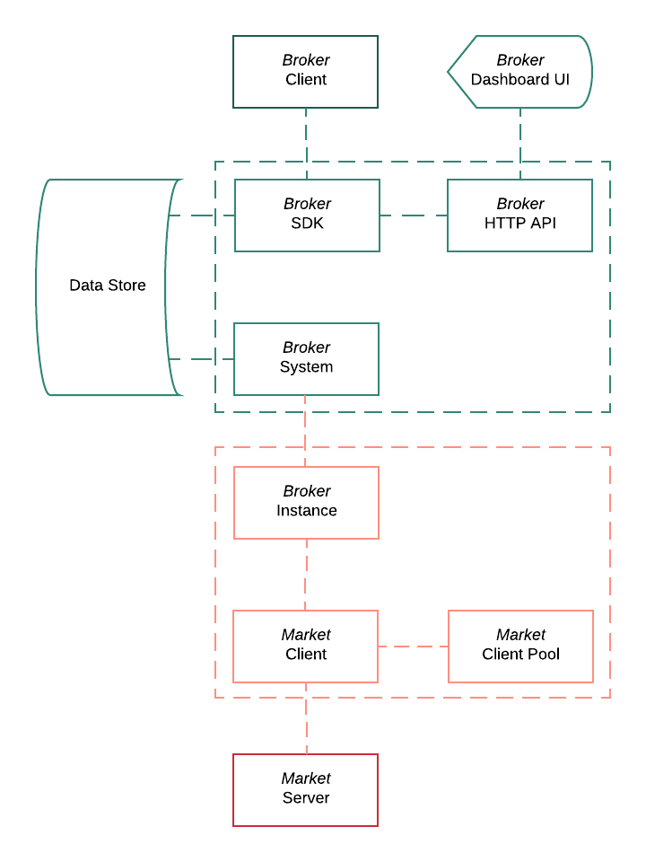

# Broker

Broker system on top of [Bull][bull-repo] to manage orders on different exchange
markets using common API.

*Bull* provides [API and event system][bull-docs] to follow job completion.

[bull-repo]: https://github.com/OptimalBits/bull
[bull-docs]: https://github.com/OptimalBits/bull/blob/master/REFERENCE.md

## Flow

High-level diagram of interconnected parts.



## Usage

```js
const Bull = require('bull')

const broker = new Bull('broker')

const order = {
  symbol: 'ethusd',
  amount: 0.2,
  type  : 'MARKET',
  side  : 'BUY'
}

broker
  .add('bitfinex', order)
  // await for `job` instantiation
  .then(job => job.finished())
  // process successful job completion
  .then(res => console.log(res))
  // process failure
  .catch(err => console.error(err.message))
```

## Order Schema

TODO


