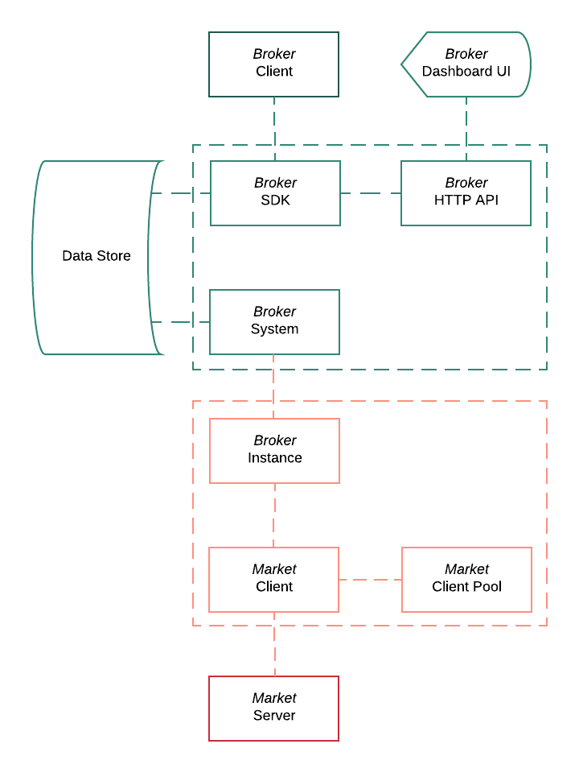

# Broker

Broker system on top of [Bull][bull-repo] job queue to manage orders on various with unified API.

[bull-repo]: https://github.com/OptimalBits/bull

## Flow

High-level diagram of interconnected parts.



## Usage

```js
const { createQueue } = require('@alpinist/orders-queue')

const broker = createQueue()

// Submit function in async fashion

async function submit (order) {
  const processor = order.broker
  const jobId = order.id

  const job = await broker.add(order.broker, order, { jobId })

  return job.finished()
}

// Perform

const order = {
  id     : 'a',
  broker : 'bitfinex',
  symbol : 'ethusd',
  amount : 0.2,
  price  : 500,
  type   : 'market',
  side   : 'buy'
}

submit(order)
  .then(console.log)
  .catch(console.error)
```
